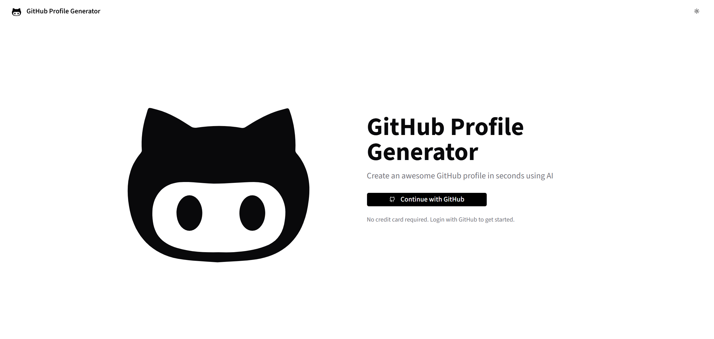
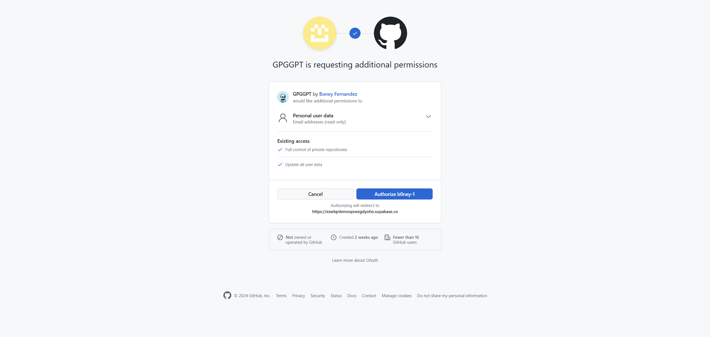
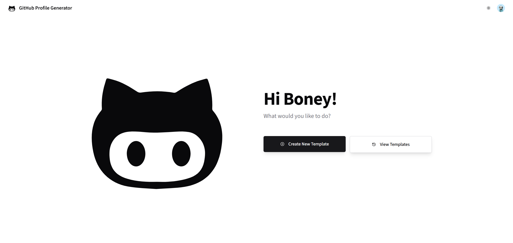
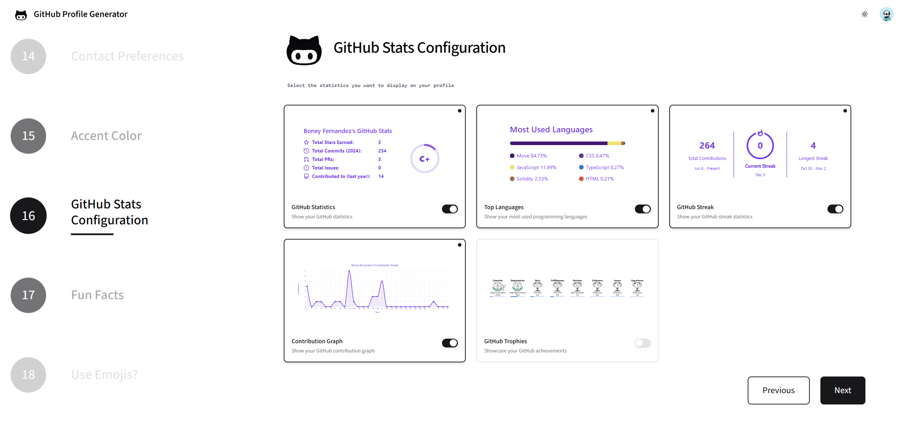
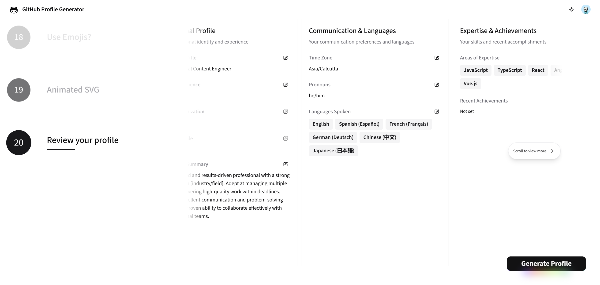
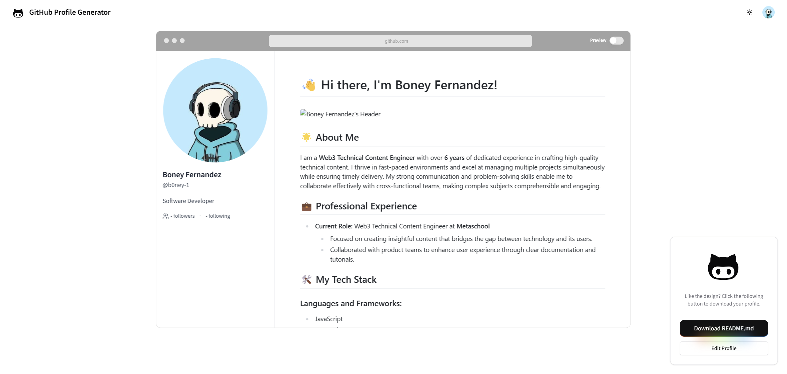
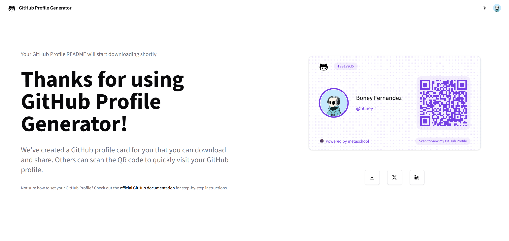

# GitHub Profile Generator GPT

Create stunning GitHub profile READMEs effortlessly with our AI-powered generator. This tool helps developers showcase their skills, projects, and personality through beautifully crafted GitHub profile pages. Whether you're a beginner looking to create your first GitHub profile or an experienced developer wanting to refresh your online presence, our generator provides a personalized and professional solution.

Built with Next.js and powered by AI technology, this open-source project helps developers create engaging and dynamic GitHub profile READMEs.

## Live Demo

[Live Demo](#)

## Features

- AI-powered profile content generation
- Customizable themes and layouts
- Real-time markdown preview
- Interactive theme editor
- Export to markdown
- QR code generation for profile sharing
- Multiple language support
- Dark/Light mode support

## Technologies Used

- Next.js with App Router
- Tailwind CSS and Shadcn UI components
- Supabase for authentication
- Shadcn UI components
- Framer Motion for animations
- React Markdown for preview
- OpenAI for content generation

## Use Cases

- Create professional GitHub profile READMEs with AI assistance
- Customize your profile's appearance with themes and styling options
- Share your GitHub profile easily with QR codes
- Maintain multiple profile versions for different purposes

## Installation Steps

1. Clone the repository

```bash
git clone https://github.com/0xmetaschool/GitHubProfileGeneratorGPT.git
cd GitHubProfileGeneratorGPT
```

2. Install dependencies

```bash
npm install
```

3. Configure environment variables
   Create a `.env.local` file in the root directory:

```env
OPENAI_API_KEY=
SUPABASE_URL=
SUPABASE_ANON_KEY=
```

To obtain the required credentials:

- `OPENAI_API_KEY`: Generate an API key from your [OpenAI dashboard](https://platform.openai.com/api-keys)
- `SUPABASE_URL` and `SUPABASE_ANON_KEY`: Create a new project on [Supabase](https://supabase.com) and get your credentials
- `GITHUB_CLIENT_ID` and `GITHUB_CLIENT_SECRET`:
  1. Go to GitHub Settings > Developer Settings > OAuth Apps
  2. Click "New OAuth App"
  3. Fill in the application details:
     - Application name: GitHub Profile Generator GPT (or your preferred name)
     - Homepage URL: http://localhost:3000 (for development)
     - Authorization callback URL: https://[your-supabase-project].supabase.co/auth/v1/callback
  4. Register the application
  5. Copy the Client ID and generate a new Client Secret
  6. In your Supabase dashboard:
     - Go to Authentication > Providers
     - Enable GitHub provider
     - Enter the GitHub Client ID and Client Secret

4. Start the development server

```bash
npm run dev
```

5. Open your browser and navigate to `http://localhost:3000`

## Screenshots

<div align="center">
  <div style="display: grid; grid-template-columns: repeat(2, 1fr); gap: 20px; margin-bottom: 20px;">
    
    
  </div>
  
  <div style="display: grid; grid-template-columns: repeat(2, 1fr); gap: 20px; margin-bottom: 20px;">
    
    
  </div>
  
  <div style="display: grid; grid-template-columns: repeat(2, 1fr); gap: 20px; margin-bottom: 20px;">
    
    
  </div>
  
  <div style="display: grid; grid-template-columns: 1fr; gap: 20px;">
    
  </div>
</div>

## How to use the application

- Sign in using your GitHub authentication (requires GitHub account)
- Start with a blank template
- Fill in your information using the form
- Customize the appearance and components
- Preview your profile
- Export the markdown code
- Generate a GitHub Profile card with QR code to share your profile

## Contributing

We welcome contributions! Here's how you can help improve the project:

1. Fork the repository
2. Create your feature branch (`git checkout -b feature/AmazingFeature`)
3. Commit your changes (`git commit -m 'Add AmazingFeature'`)
4. Push to the branch (`git push origin feature/AmazingFeature`)
5. Open a Pull Request

## License

This project is licensed under the MIT License - see the [LICENSE](LICENSE) file for details.

## Contact

For questions, suggestions, or collaboration opportunities, please open an issue in the repository.
